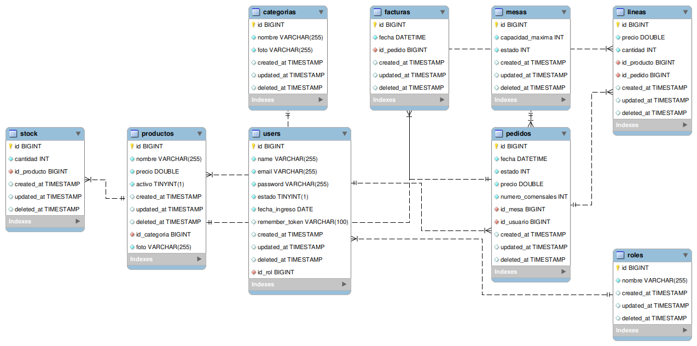

# TODO

* cálculos de precios (pedidos, productos, etc) [que no puedan ser negativos] (Done)
* secure routes before production

##### Side note

Si el administrador acaba pudiendo crear / eliminar roles, descartar el array en el modelo User y getRol() en el resource.

-------

# Casos de uso con sus endpoints

### Los campos marcados con (admin) son para el panel de administración

## Roles

| Caso de uso            | Endpoint   | Método HTTP |
| ---------------------- | ---------- | ----------- |
| Buscar todos los roles | /roles     | GET         |
| Buscar un rol por id   | /roles/{id}| GET         |
| Crear un rol (admin)   | /roles/new | POST        |
| Eliminar un rol (admin)| /roles/{id}| DELETE      |
| Editar un rol (admin)  | /roles/{id}| PUT         |
| Buscar todos los usuarios de un rol concreto (admin) | /roles/{id}/usuarios | GET |

## Usuarios

| Caso de uso                                | Endpoint              | Método HTTP |
| ------------------------------------------ | --------------------- | ----------- |
| Listar todos los usuarios (admin)          | /usuarios             | GET         |
| Buscar un usuario por id                   | /usuarios/{id}        | GET         |
| Login                                      | /login                | POST        |
| Registro                                   | /registro             | POST        |
| Cierre de sesión                           | /logout               | POST        |
| Editar usuario (admin)                     | /usuarios/{id}        | PUT         |
| Buscar los pedidos manejados por un usuario (filtrado por mesero en el cliente)| /usuarios/{id}/pedidos| GET         |

## Categorias

| Caso de uso                           | Endpoint             | Método HTTP |
| ------------------------------------- | -------------------- | ----------- |
| Buscar todas las categorias           | /categorias          | GET         |
| Buscar una categoría por id           | /categorias/{id}     | GET         |
| Crear una categoría                   | /categorias/new      | POST        |
| Eliminar una categoría (admin)        | /categorias/{id}     | DELETE      |
| Buscar todos los productos de una categoría | /categorias/{id}/productos | GET | 
| Editar una categoría                  | /categorias/{id}     | PUT         |

## Productos

| Caso de uso                           | Endpoint             | Método HTTP |
| ------------------------------------- | -------------------- | ----------- |
| Buscar todos los productos            | /productos           | GET         |
| Buscar un producto por id             | /productos/{id}      | GET         |
| Crear un nuevo producto               | /productos/new       | POST        |
| Eliminar un producto                  | /productos/{id}      | DELETE      |
| Editar un producto                    | /productos/{id}      | PUT         | 
| Buscar el stock de un producto        | /productos/{id}/stock| GET         |

## Stock

| Caso de uso                            | Endpoint              | Método HTTP |
| -------------------------------------- | --------------------- | ----------- |
| Buscar el stock de todos los productos | /stock                | GET         |
| Buscar un stock por id                 | /stock/{id}           | GET         |
| Dar de alta un stock                   | /stock/new            | POST        |
| Editar un stock                        | /stock/{id}           | PUT         |
| Eliminar un stock (admin only)         | /stock/{id}           | DELETE      |  

## Mesas

| Caso de uso            | Endpoint   | Método HTTP |
| ---------------------- | ---------- | ----------- |
| Buscar todas las mesas | /mesas     | GET         |
| Buscar una mesa por id | /mesas/{id}| GET         |
| Crear una mesa         | /mesas/new | POST        |
| Eliminar una mesa      | /mesas/{id}| DELETE      |
| Editar una mesa        | /mesas/{id}| PUT         |

## Pedidos

| Caso de uso                    | Endpoint              | Método HTTP |
| ------------------------------ | --------------------- | ----------- |
| Buscar todos los pedidos       | /pedidos              | GET         |
| Buscar un pedido por id        | /pedidos/{id}         | GET         |
| Crear un pedido                | /pedidos/new          | POST        |
| Editar un pedido (admin)       | /pedidos/{id}         | PUT         |
| Eliminar un pedido (admin)     | /pedidos/{id}         | DELETE      | 
| Buscar las líneas de un pedido | /pedidos/{id}/lineas  | GET         |
| Buscar la factura de un pedido | /pedidos/{id}/factura | GET         |

## Lineas

| Caso de uso                    | Endpoint              | Método HTTP |
| ------------------------------ | --------------------- | ----------- |
| Buscar todas las lineas        | /lineas               | GET         |
| Buscar una línea por id        | /lineas/{id}          | GET         |
| Añadir una nueva línea (teoricamente se le asigna el id del pedido en el cuerpo de la peticion)         | /lineas/new | POST |
| Editar una línea               | /lineas/{id}          | PUT         |
| Eliminar una línea             | /lineas/{id}          | DELETE      | 

## Facturas

| Caso de uso                    | Endpoint              | Método HTTP |
| ------------------------------ | --------------------- | ----------- |
| Buscar todas las facturas      | /facturas             | GET         |
| Buscar una factura por id      | /facturas/{id}        | GET         |
| Crear una factura              | /facturas/new         | POST        |
| Eliminar una factura (admin)   | /facturas/{id}        | DELETE      |

---------------------
<br>

# Tablas de la Base de Datos

## Roles

```sql
CREATE TABLE roles(
  id INT NOT NULL AUTO_INCREMENT,
  nombre VARCHAR2 NOT NULL,
  PRIMARY KEY(id)
);
```

## Usuarios

```sql
CREATE TABLE usuarios(
  id INT NOT NULL AUTO_INCREMENT,
  name VARCHAR2 NOT NULL,
  email VARCHAR2 UNIQUE NOT NULL,
  password VARCHAR2 NOT NULL,
  estado BOOLEAN DEFAULT true NOT NULL, -- Alta / Baja
  fecha_ingreso DATE NOT NULL,
  id_rol INT NOT NULL,
  PRIMARY KEY(id),
  FOREIGN KEY(id_rol) REFERENCES roles(id)
);
```

## Categorias

```sql
CREATE TABLE categorias(
  id INT NOT NULL AUTO_INCREMENT,
  nombre VARCHAR2 NOT NULL,
  foto VARCHAR2 NOT NULL,
  PRIMARY KEY(id)
);
```

## Productos

```sql
CREATE TABLE productos(
  id INT NOT NULL AUTO_INCREMENT,
  nombre VARCHAR2 NOT NULL,
  precio FLOAT NOT NULL DEFAULT 0,
  activo BOOLEAN NOT NULL DEFAULT TRUE,
  foto VARCHAR2 NOT NULL,
  PRIMARY KEY(id)
);
```

## Stock

```sql
CREATE TABLE stock(
  id INT NOT NULL AUTO_INCREMENT,
  cantidad INT NOT NULL DEFAULT 0,
  id_producto INT NOT NULL UNIQUE,
  PRIMARY KEY(id),
  FOREIGN KEY(id_producto) REFERENCES productos(id)
);
```

## Mesas

```sql
CREATE TABLE mesas(
  id INT NOT NULL AUTO_INCREMENT,
  capacidad_maxima INT NOT NULL DEFAULT 0,
  estado INT NOT NULL,
  PRIMARY KEY(id),
  CHECK estado <= 2 AND estado >= 0
  );
```

## Pedidos

```sql
CREATE TABLE pedidos(
  id INT NOT NULL AUTO_INCREMENT,
  fecha DATETIME NOT NULL,
  estado INT NOT NULL,
  numero_comensales INT NOT NULL DEFAULT 1,
  id_mesa INT NOT NULL,
  id_usuario INT NOT NULL,
  PRIMARY KEY(id),
  FOREIGN KEY(id_mesa) REFERENCES mesas(id),
  FOREIGN KEY(id_usuario) REFERENCES usuarios(id),
  CHECK estado<= 3 AND estado >= 0
); 
```

## Lineas

```sql
CREATE TABLE lineas(
  id INT NOT NULL AUTO_INCREMENT,
  precio FLOAT NOT NULL DEFAULT 0,
  cantidad INT NOT NULL DEFAULT 1,
  id_producto INT NOT NULL,
  id_pedido INT NOT NULL,
  PRIMARY KEY(id),
  FOREIGN KEY(id_producto) REFERENCES productos(id),
  FOREIGN KEY(id_pedido) REFERENCES pedidos(id)
);
```

## Facturas

```sql
CREATE TABLE facturas(
  id INT NOT NULL AUTO_INCREMENT,
  fecha DATETIME NOT NULL,
  id_pedido INT NOT NULL UNIQUE,
  PRIMARY KEY(id),
  FOREIGN KEY(id_pedido) REFERENCES pedidos(id)
);
```
---------------------

## Diagrama Entidad-Relación


---------------------

## Preparar el entorno para probar la API

```bash
git clone https://github.com/jdfs2110/restaurant-api.git
cd restaurant-api/
```

#### Prerrequisitos

> [!WARNING]
> Si el sistema operativo es Windows, es necesario utilizar WSL

* php
* docker

### Instalación de dependencias

> [!WARNING]
> A partir de este punto, todos los comandos son hechos a partir del directorio raíz del proyecto

```bash
docker run --rm \
    -u "$(id -u):$(id -g)" \
    -v "$(pwd):/var/www/html" \
    -w /var/www/html \
    laravelsail/php83-composer:latest \
    composer install --ignore-platform-reqs
```

### Levantar la API

```bash
./vendor/bin/sail up -d
```
### Realizar las migraciones de las tablas

```bash
php artisan migrate
```
En caso de hacer una migración limpia (borrando los datos anteriores)
```bash
php artisan migrate:fresh
```

### Generar datos de prueba
```bash
php artisan db:seed
```

### Parar la api y eliminar los contenedores
```bash
./vendor/bin/sail down
```

Realizar las peticiones a http://localhost/api/endpoint
