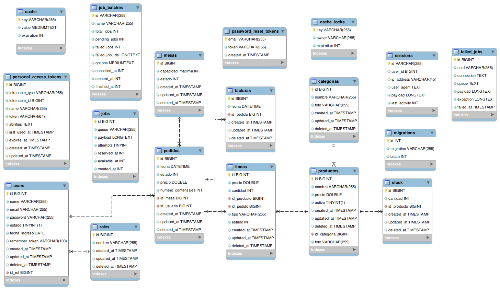

# Casos de uso con sus endpoints

### Los campos marcados con (admin) son para el panel de administración

## Roles

| Caso de uso                     | Endpoint             | Método HTTP |
|---------------------------------|----------------------|-------------|
| Buscar todos los roles (admin)  | /roles               | GET         |
| Buscar un rol por id (admin)    | /roles/{id}          | GET         |
| Crear un rol (admin)            | /roles/new           | POST        |
| Eliminar un rol (admin)         | /roles/{id}          | DELETE      |
| Editar un rol (admin)           | /roles/{id}          | PUT         |
| Listar usuarios por rol (admin) | /roles/{id}/usuarios | GET         |

## Usuarios

| Caso de uso                                         | Endpoint                 | Método HTTP |
|-----------------------------------------------------|--------------------------|-------------|
| Listar todos los usuarios paginados (admin)         | /usuarios                | GET         |
| Obtener el número de páginas existentes (admin)     | /usuarios/pages          | GET         |
| Buscar un usuario por id (admin o self)             | /usuarios/{id}           | GET         |
| Login                                               | /login                   | POST        |
| Registro (admin)                                    | /registro                | POST        |
| Cierre de sesión                                    | /logout                  | POST        |
| Editar usuario (admin o self)                       | /usuarios/{id}           | PUT         |
| Buscar los pedidos manejados por un usuario (admin) | /usuarios/{id}/pedidos   | GET         |
| Eliminar usuario (admin)                            | /usuarios/{id}           | DELETE      | 
| Listar usuarios con nombre similar a una cadena     | /usuarios/similar/{name} | GET         |
| Cambiarle la contraseña al usuario (admin)          | /usuarios/{id}/password  | POST        | 
| Revocar tokens de acceso (admin)                    | /usuarios/{id}/tokens    | DELETE      |

## Categorias

| Caso de uso                                       | Endpoint                   | Método HTTP |
|---------------------------------------------------|----------------------------|-------------|
| Listar todas las categorias paginadas (admin)     | /categorias                | GET         |
| Obtener el número de páginas existentes (admin)   | /categorias/pages          | GET         |
| Buscar una categoría por id (admin)               | /categorias/{id}           | GET         |
| Crear una categoría (admin)                       | /categorias/new            | POST        |
| Eliminar una categoría (admin)                    | /categorias/{id}           | DELETE      |
| Buscar todos los productos de una categoría       | /categorias/{id}/productos | GET         | 
| Editar una categoría (admin)                      | /categorias/{id}           | PUT         |
| Listar categorias con nombre similar a una cadena | /categorias/similar/{name} | GET         |

## Productos

| Caso de uso                                      | Endpoint                     | Método HTTP |
|--------------------------------------------------|------------------------------|-------------|
| Listar todos los productos paginados             | /productos                   | GET         |
| Obtener el número de páginas existentes          | /productos/pages             | GET         |
| Buscar un producto por id                        | /productos/{id}              | GET         |
| Crear un nuevo producto (admin)                  | /productos/new               | POST        |
| Eliminar un producto (admin)                     | /productos/{id}              | DELETE      |
| Editar un producto (admin)                       | /productos/{id}              | PUT         | 
| Buscar el stock de un producto                   | /productos/{id}/stock        | GET         |
| Aumentar el stock de un producto                 | /productos/{id}/stock/add    | POST        | 
| Reducir el stock de un producto                  | /productos/{id}/stock/reduce | POST        |
| Listar productos con nombre similar a una cadena | /productos/similar/{name}    | GET         |

## Stock

| Caso de uso                                     | Endpoint     | Método HTTP |
|-------------------------------------------------|--------------|-------------|
| Listar el stock de todos los productos paginado | /stock       | GET         |
| Obtener el número de páginas existentes         | /stock/pages | GET         |
| Dar de alta un stock (admin) --pointless--      | /stock/new   | POST        |
| Editar un stock                                 | /stock/{id}  | PUT         |

## Mesas

| Caso de uso                         | Endpoint            | Método HTTP |
|-------------------------------------|---------------------|-------------|
| Buscar todas las mesas              | /mesas              | GET         |
| Buscar una mesa por id              | /mesas/{id}         | GET         |
| Crear una mesa (admin)              | /mesas/new          | POST        |
| Eliminar una mesa (admin)           | /mesas/{id}         | DELETE      |
| Editar una mesa                     | /mesas/{id}         | PUT         |
| Listar los pedidos de una mesa      | /mesas/{id}/pedidos | GET         |
| Listar el pedido actual de una mesa | /mesas/{id}/pedido  | GET         |

## Pedidos

| Caso de uso                                  | Endpoint               | Método HTTP |
|----------------------------------------------|------------------------|-------------|
| Listar todos los pedidos paginados           | /pedidos               | GET         |
| Obtener el número de páginas existentes      | /pedidos/pages         | GET         |
| Buscar un pedido por id                      | /pedidos/{id}          | GET         |
| Crear un pedido                              | /pedidos/new           | POST        |
| Editar un pedido                             | /pedidos/{id}          | PUT         |
| Eliminar un pedido                           | /pedidos/{id}          | DELETE      | 
| Buscar las líneas de un pedido               | /pedidos/{id}/lineas   | GET         |
| Buscar la factura de un pedido               | /pedidos/{id}/factura  | GET         |
| Cambiar el estado de un pedido a 'servido'   | /pedidos/{id}/servir   | POST        |
| Cambiar el estado de un pedido a 'cancelado' | /pedidos/{id}/cancelar | POST        |

## Lineas

| Caso de uso                                      | Endpoint               | Método HTTP |
|--------------------------------------------------|------------------------|-------------|
| Listar todas las lineas paginadas (admin)        | /lineas                | GET         |
| Obtener el número de páginas existentes  (admin) | /lineas/pages          | GET         |
| Buscar una línea por id                          | /lineas/{id}           | GET         |
| Añadir una nueva línea                           | /lineas/new            | POST        |
| Editar una línea                                 | /lineas/{id}           | PUT         |
| Eliminar una línea                               | /lineas /{id}          | DELETE      | 
| Recuperar las líneas de cocina                   | /lineas/tipo/cocina    | GET         |
| Recuperar las líneas de la barra                 | /lineas/tipo/barra     | GET         |
| Cambiar el estado una línea a 'completada'       | /lineas/{id}/completar | POST        |

## Facturas

| Caso de uso                                     | Endpoint         | Método HTTP |
|-------------------------------------------------|------------------|-------------|
| Listar todas las facturas paginadas (admin)     | /facturas        | GET         |
| Obtener el número de páginas existentes (admin) | /facturas/pages  | GET         |
| Buscar una factura por id (admin?)              | /facturas/{id}   | GET         |
| Crear una factura                               | /facturas/new    | POST        |
| Editar una factura                              | /facturas/{id}   | PUT         |
| Eliminar una factura (admin)                    | /facturas/{id}   | DELETE      |

---------------------
<br>

# Tablas de la Base de Datos

## Roles

```sql
CREATE TABLE roles(
  id INT NOT NULL AUTO_INCREMENT,
  nombre VARCHAR2 NOT NULL,
  PRIMARY KEY(id)
);
```

## Usuarios

```sql
CREATE TABLE usuarios(
  id INT NOT NULL AUTO_INCREMENT,
  name VARCHAR2 NOT NULL,
  email VARCHAR2 UNIQUE NOT NULL,
  password VARCHAR2 NOT NULL,
  estado BOOLEAN DEFAULT true NOT NULL, -- Alta / Baja
  fecha_ingreso DATE NOT NULL,
  id_rol INT NOT NULL,
  PRIMARY KEY(id),
  FOREIGN KEY(id_rol) REFERENCES roles(id)
);
```

## Categorias

```sql
CREATE TABLE categorias(
  id INT NOT NULL AUTO_INCREMENT,
  nombre VARCHAR2 NOT NULL,
  foto VARCHAR2 NOT NULL,
  PRIMARY KEY(id)
);
```

## Productos

```sql
CREATE TABLE productos(
  id INT NOT NULL AUTO_INCREMENT,
  nombre VARCHAR2 NOT NULL,
  precio FLOAT NOT NULL DEFAULT 0,
  activo BOOLEAN NOT NULL DEFAULT TRUE,
  foto VARCHAR2 NOT NULL,
  PRIMARY KEY(id)
);
```

## Stock

```sql
CREATE TABLE stock(
  id INT NOT NULL AUTO_INCREMENT,
  cantidad INT NOT NULL DEFAULT 0,
  id_producto INT NOT NULL UNIQUE,
  PRIMARY KEY(id),
  FOREIGN KEY(id_producto) REFERENCES productos(id)
);
```

## Mesas

```sql
CREATE TABLE mesas(
  id INT NOT NULL AUTO_INCREMENT,
  capacidad_maxima INT NOT NULL DEFAULT 0,
  estado INT NOT NULL,
  PRIMARY KEY(id),
  CHECK estado <= 2 AND estado >= 0
  );
```

## Pedidos

```sql
CREATE TABLE pedidos(
  id INT NOT NULL AUTO_INCREMENT,
  fecha DATETIME NOT NULL,
  estado INT NOT NULL,
  numero_comensales INT NOT NULL DEFAULT 1,
  id_mesa INT NOT NULL,
  id_usuario INT NOT NULL,
  PRIMARY KEY(id),
  FOREIGN KEY(id_mesa) REFERENCES mesas(id),
  FOREIGN KEY(id_usuario) REFERENCES usuarios(id),
  CHECK estado<= 3 AND estado >= 0
); 
```

## Lineas

```sql
CREATE TABLE lineas(
  id INT NOT NULL AUTO_INCREMENT,
  precio FLOAT NOT NULL DEFAULT 0,
  cantidad INT NOT NULL DEFAULT 1,
  id_producto INT NOT NULL,
  id_pedido INT NOT NULL,
  tipo VARCHAR2 NOT NULL, -- barra / cocina,
  estado INT NOT NULL,
  CHECK estado>=0 AND estado <=2,
  PRIMARY KEY(id),
  FOREIGN KEY(id_producto) REFERENCES productos(id),
  FOREIGN KEY(id_pedido) REFERENCES pedidos(id)
);
```

## Facturas

```sql
CREATE TABLE facturas(
  id INT NOT NULL AUTO_INCREMENT,
  fecha DATETIME NOT NULL,
  id_pedido INT NOT NULL UNIQUE,
  PRIMARY KEY(id),
  FOREIGN KEY(id_pedido) REFERENCES pedidos(id)
);
```
---------------------

## Diagrama Entidad-Relación


---------------------

## Preparar el entorno para probar la API

```bash
git clone https://github.com/jdfs2110/restaurant-api.git
cd restaurant-api/
```

#### Prerrequisitos

> [!WARNING]
> Si el sistema operativo es Windows, es necesario utilizar WSL

* php
* docker

### Instalación de dependencias

> [!WARNING]
> A partir de este punto, todos los comandos son hechos a partir del directorio raíz del proyecto

```bash
docker run --rm \
    -u "$(id -u):$(id -g)" \
    -v "$(pwd):/var/www/html" \
    -w /var/www/html \
    laravelsail/php83-composer:latest \
    composer install --ignore-platform-reqs
```

> [!TIP]
> Es recomendable añadir el alias de abajo para no tener que poner './vendor/bin/sail' para cada comando

```bash
alias sail='sh $([ -f sail ] && echo sail || echo vendor/bin/sail)'
```

> [!NOTE]
> Si al final no has utilizado el alias, cada comando se haría con './vendor/bin/sail' en vez de únicamente 'sail'

### Levantar la API

```bash
sail up -d
```
### Realizar las migraciones de las tablas

```bash
sail artisan migrate
```
En caso de hacer una migración limpia (borrando los datos anteriores)
```bash
sail artisan migrate:fresh
```

### Generar datos de prueba
```bash
sail artisan db:seed
```

### Parar la api y eliminar los contenedores
```bash
sail down
```

Realizar las peticiones a http://localhost/api/endpoint
